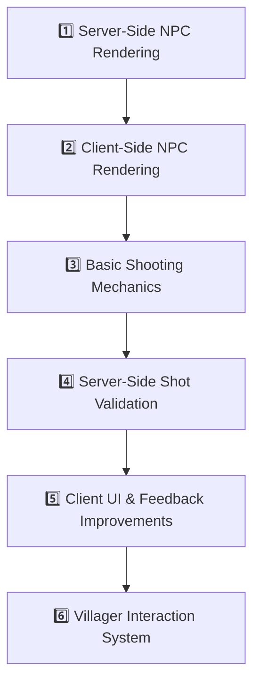
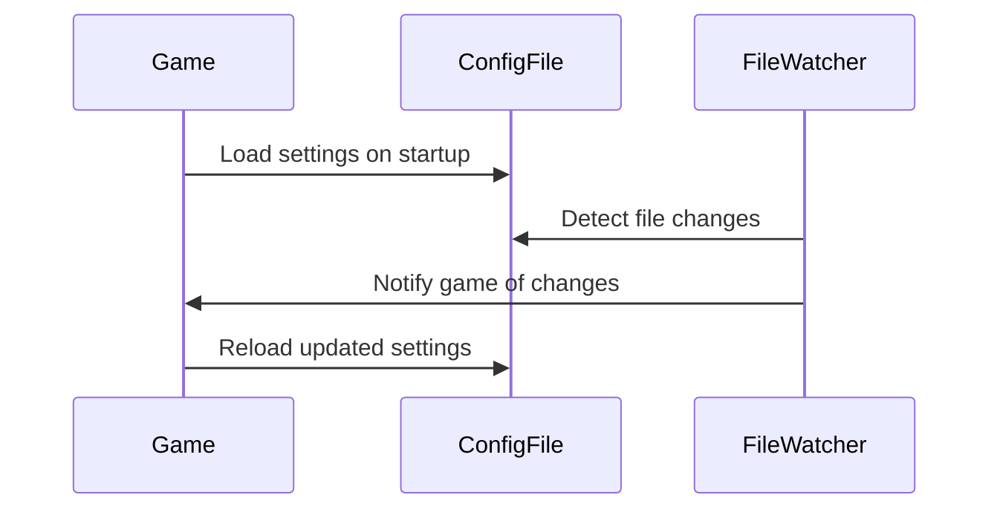

# 🏗️ Game Feature Development Roadmap

> **📝 Progress Tracker**
> Replace `[ ]` with `[x]` to mark tasks as complete.

---

## 🖥️ Server-Side Features
### 🏡 NPC Management
- [ ] Render **villager NPCs** (handle appearance, spawn logic)
- [ ] Implement **zombie spawning** based on time
  - [ ] Zombies appear at **night**
  - [ ] Zombies **despawn at sunrise**
- [ ] Manage **villager interactions**
  - [ ] Implement **trading system** (basic UI, validation)
  - [ ] Add **dialogue system** (store & serve text responses)
- [ ] Handle **NPC kills** (server-side logic, sync with clients)

### 🎯 Combat & Hit Validation
- [ ] Implement **server-side shot processing**
  - [ ] Validate **player shot data** (position, timestamp)
  - [ ] Verify **hits/misses** against zombies & villagers
- [ ] Handle **zombie & villager deaths**
  - [ ] Notify clients when an NPC dies
  - [ ] Update **server game state** for dead NPCs

---

## 🎮 Client-Side Features
### ✨ NPC Rendering
- [ ] Display **villager sprites/3D models**
- [ ] Render **zombies** using game assets

### 🔫 Combat & Shooting Mechanics
- [ ] Implement **shooting mechanics**
  - [ ] Aim, fire, play animations
  - [ ] Send **shot data** to server (position, target, timestamp)
- [ ] Handle **hit detection feedback**
  - [ ] Display **visual & audio feedback** on hit/miss
  - [ ] Sync **confirmed kills** with the server

### 🎭 UI & Player Interaction
- [ ] Improve **game UI design**
  - [ ] Health bar, ammo counter, kill feed
- [ ] Add **villager interaction system**
  - [ ] Implement **“Talk” button**
  - [ ] Display **trading interface**

---

## 🚀 **Feature Priority & Development Order**

# Hot Reload System

