# 🏗️ Game Feature Development Roadmap

This document is your go-to tracker for game feature development. As you complete each task, simply update the checkboxes by replacing `[ ]` with `[x]`.

---

## 📋 Progress Tracker

**How to Use:**
- Check off tasks by updating `[ ]` to `[x]`.
- Use the mermaid diagrams to quickly visualize the development flow and system interactions.
- Keep this file open alongside your code editor for easy updates.

---

## 1️⃣ Server-Side Features

### 1.1 NPC Management
- [ ] **Render Villager NPCs**
  - Handle appearance, spawn logic.
- [ ] **Implement Zombie Spawning**
  - [ ] Zombies appear at **night**.
  - [ ] Zombies **despawn at sunrise**.
- [ ] **Manage Villager Interactions**
  - [ ] Implement **trading system** (basic UI, validation).
  - [ ] Add **dialogue system** (store & serve text responses).
- [ ] **Handle NPC Kills**
  - Implement server-side logic and sync with clients.

### 1.2 Combat & Hit Validation
- [ ] **Implement Server-Side Shot Processing**
  - [ ] Validate player shot data (position, timestamp).
  - [ ] Verify hits/misses against zombies & villagers.
- [ ] **Handle NPC Deaths**
  - [ ] Notify clients when an NPC dies.
  - [ ] Update server game state for dead NPCs.

---

## 2️⃣ Client-Side Features

### 2.1 NPC Rendering
- [ ] **Display Villager Sprites/3D Models**
- [ ] **Render Zombies** using game assets.

### 2.2 Combat & Shooting Mechanics
- [ ] **Implement Shooting Mechanics**
  - [ ] Aim, fire, and play animations.
  - [ ] Send shot data to server (position, target, timestamp).
- [ ] **Handle Hit Detection Feedback**
  - [ ] Display visual & audio feedback on hit/miss.
  - [ ] Sync confirmed kills with the server.

### 2.3 UI & Player Interaction
- [ ] **Improve Game UI Design**
  - [ ] Health bar, ammo counter, kill feed.
- [ ] **Add Villager Interaction System**
  - [ ] Implement “Talk” button.
  - [ ] Display trading interface.

---

## 3️⃣ Feature Priority & Development Order

```mermaid
graph TD;
    A["1️⃣ Server-Side NPC Rendering"] --> B["2️⃣ Client-Side NPC Rendering"];
    B --> C["3️⃣ Basic Shooting Mechanics"];
    C --> D["4️⃣ Server-Side Shot Validation"];
    D --> E["5️⃣ Client UI & Feedback Improvements"];
    E --> F["6️⃣ Villager Interaction System"];
```

## 4 Asset Drawing
- elevation tiles (multiple)
- river tiles
- house tiles (at least 3 more)
- allow house tiles to be different sizes for different results